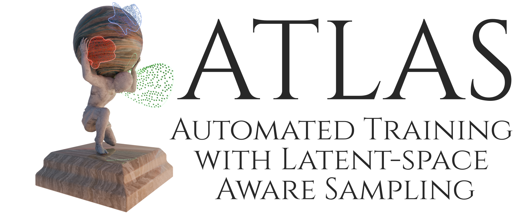
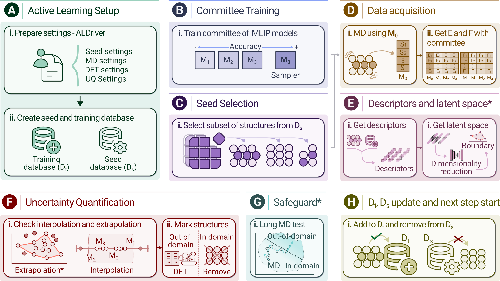

# ATLAS

> [!WARNING]
> **Under Development:** This library is still under active development and may contain bugs or undergo breaking changes. Use with caution in production or critical research workflows. Please report any bugs or issues using the [Issues tab](https://github.com/pol-sb/ATLAS/issues).

<p align="center">
  <picture>
    <source media="(prefers-color-scheme: dark)" srcset="media/logo_dark.png">
    <source media="(prefers-color-scheme: light)" srcset="media/logo_light.png">
    
  </picture>
</p>

[](https://doi.org/10.26434/chemrxiv.15003942/v1) 

   [](https://lopezgroup-iciq.github.io/ATLAS/master/index.html)


[](https://github.com/astral-sh/ruff)


ATLAS (Automated Training with Latent-space Aware Sampling) is a unified Python framework for building robust machine learning interatomic potentials (MLIPs). It combines a diversity-aware database generator with a manifold-aware active learning workflow to produce compact, high-quality training datasets. ATLAS supports structure generation for bulk, surface, cluster, and isolated atom configurations across single-, binary-, and ternary (WIP) phase diagrams, with perturbations, vacancies, deformations, and adsorbates. 

The active learning engine iteratively trains MACE models, runs molecular dynamics simulations, detects extrapolating structures via descriptor-based or latent-space methods (autoencoder + concave hull), and submits them for DFT labelling, all orchestrated through AiiDA. Additional capabilities include data reduction mode, safeguard checks to prevent premature convergence, test database evaluation, diversity metrics (Vendi Score, Circles Metric), an interactive monitoring dashboard, a desktop GUI (in development), MLIP benchmarking, and comprehensive reporting of model performance and resource usage. 

Validated on metals, alloys, and metal oxides, ATLAS produces datasets that exceed foundation model training chemical spaces by orders of magnitude while using up to x300 fewer structures.


> [!NOTE]
> **Preprint Available:** The theoretical framework and benchmarking for this project are now available as a working paper on ChemRxiv: [Balancing Diversity and Efficiency in Training Datasets for Robust Machine Learning Potentials](https://doi.org/10.26434/chemrxiv.15003942/v1). 


## Table of Contents

- [Installation](#installation)
- [Developer Workflow](#developer-workflow)
- [Usage](#usage)
- [Example: Training a MACE MLIP from scratch](#example-training-a-mace-mlip-from-scratch)
- [Package Structure](#package-structure)
- [Implementation Details](#implementation-details)
- [Authors and Maintainers](#authors-and-maintainers)

## Installation

To install ATLAS, you can use pip in a python virtual environment or conda environment. Development has been made with `python3.11` in mind, which can be installed through the OS's package manager or conda.

### 1. Creating a python environment

First, **create a virtual environment** and activate it. This can be done in several ways, but we provide some examples using `conda`, python `venv` or `uv`.

#### Option A - `conda`

```bash
# Create a conda environment named atlas which uses python 3.11
conda create -n atlas python=3.11

# Activate the environment
conda activate atlas
```

#### Option B - `venv`

An example for an Ubuntu 22.04 system, using python3.11 and venv:

```bash
# Install python3.11 and venv
sudo apt install python3.11 python3.11-venv

# Using python venv - create and activate the environment
python3 -m venv atlas
source atlas/bin/activate
```

#### Option C - `uv`

First, install the `uv` tool. Either as shown below using the standalone installer, or please refer to the [official uv installation guide](https://docs.astral.sh/uv/getting-started/installation/) for more options.

```bash
wget -qO- https://astral.sh/uv/install.sh | sh
```

Once `uv` is isntalled, create an environment named atlas specifically with Python 3.11:

```bash
# Create the virtual environment
uv venv atlas --python 3.11
```

Make sure to navigate to a folder where you would like your python environment to be located, or specify the desired path.
You can activate the newly created environment as follows:

```bash
source atlas/bin/activate
```

With the environment now activated, the library can be installed.

### 2. Getting the ATLAS code

```bash
# Clone the reposittory
git clone https://github.com/pol-sb/atlas.git
```

### 3. Installing the library in the activated python environment

There are several installation mechanisms, and several optional dependencies depending on what packages you want to use. Check the list and details of optional dependencies in the [pyproject.toml](pyproject.toml). Currently, the following are available:

- `mace`
- `dev`

Optional dependencies are installed using the following syntax:

```bash
python3 -m pip install ./ATLAS['OPTIONAL_DEPENDENCY_NAME']
```

Some installation examples follow:

#### Using `pip`

```bash
# Install the library and the MACE dependencies in the venv using pip
python3 -m pip install ./ATLAS['mace']
```

#### Using `uv`

```bash
# Install the library and the MACE dependencies using uv
uv pip install ./ATLAS['mace']
```

### 4. Initialize configuration files

Finally, initialize configuration files by running the **initial configuration command** (`atl_init_setup`). Then, enter your [Materials Project API key](https://next-gen.materialsproject.org/api) in the path displayed in the output to finish the setup process:

```shell
# Run the last setup step - configuration initialization
atl_init_setup
```

> [!NOTE]
> If the user is only interested in database generation, the setup can be completed only up until this point, skipping the following AiiDA setup.

### 5. Setup steps specific to active learning

- The **active learning (AL)** loop uses the [AiiDA](https://github.com/aiidateam/aiida-core) library for managing the workflow. In order to run the AL loop in compute clusters, codes and computers must be conifigured in AiiDA. See the [AiiDA installation guide](https://aiida.readthedocs.io/projects/aiida-core/en/stable/installation/guide_quick.html) for installation instructions.
- DFT calculations with VASP use the [aiida-vasp](https://aiida-vasp.readthedocs.io/en/latest/) plugin, which needs additional configuration. Please, follow the [instructions on their website](https://aiida-vasp.readthedocs.io/en/latest/getting_started/general.html).

- The steps required to set up the active learning loop with the simplest AiiDA configuration are the following:
    1. Set up an aiida profile and database with `verdi presto`.
    2. Create the AiiDA computer and code entries for ATLAS and aiida-vasp.
    3. Add the potential datasets for aiida-vasp ([information here](https://aiida-vasp.readthedocs.io/en/latest/getting_started/potentials.html)).

## Developer Workflow

Install the development dependencies with `pip install -e '.[dev]'`, which adds pre-commit, pytest, commitizen, and ipdb. After cloning, run `pre-commit install` to activate the git hooks.

The project uses **commitizen** (`cz commit`) for structured conventional commits. It prompts for change type (feat/fix/docs/style/refactor/perf/test/chore), scope (al_loop/core/init_db/md/...), and a summary message. This feeds into automated changelog generation and version bumps (`cz bump`).

On every commit, pre-commit runs three stages in sequence:

1. **Schema docs**: Regenerates `docs/source/input.md` when `config_schema.yaml` changes.
2. **ruff**: Lints all Python files with auto-fix, enforcing pycodestyle, pyflakes, pyupgrade, flake8-bugbear, isort, and numpy-style docstring rules.
3. **pytest**: Runs the full test suite (`python -m pytest tests/ -x`), stopping at the first failure.
4. **Miscellaneous**: Fixes trailing newlines, validates YAML/TOML, checks for oversized files.

If any hook fails, the commit is blocked and ruff errors must be resolved manually and tests must pass before proceeding. Run `pre-commit run --all-files` to check everything without committing, or use `cz commit --retry` to retry the last commitizen interaction after fixing issues.

## Usage

The goal of this library is to provide workflows, functions and utilities for streamlining the training of neural networks potentials (MLIPs) by means of Active Learning (AL) Loops.

During the library installation, several entry points will be added so that the user can easily run the different utilities:

- `atl_init_setup`: Run initial configuration steps after installing atlas.
- `atl_run_dft_database`: Run DFT calculations for a ATLAS structure database.
- `atl_gen_configuration_file`: Generate a `.toml` template configuration file to be used in any of the different operation modes of the code.
- `atl_gen_init_db`: Generate a database containing structures for MLIP training.
- `atl_active_learning`: Launch an AL loop using a configuration file and a labelled initial database.
- `atl_monitor_al_loop:` Launch a flask dashboard locally to monitor a running active learning loop. Open <http://127.0.0.1:8000> (or port specified in the launch arguments) in a browser to visualize the dashboard.
- `atl_benchmark_mlip`: Evaluate and compare the performance of MLIPs using a suite of benchmarks.

All of the entry points provide usage documentation when launched with the `-h`/`--help` argument, e.g.:

```bash
$> atl_gen_configuration_file --help

>>> usage:  atl_gen_configuration_file [-h] -t TYPE [-p PATH] [-o]
>>>
>>> Generate ATL default configuration files in the TOML format.
>>>
>>> options:
>>>   -h, --help
                     show this help message and exit
>>>   -t TYPE, --config_type TYPE
>>>                  Type of the configuration file to be generated. Available types are:
>>>                         - active_learning: Configuration file for active learning loop.
>>>                         - initial_db: Configuration file for initial database generation.
>>>   -p PATH, --path PATH
                        Path in which to store the file.
                        Will use the CWD by default. Folders will be created if necessary.
>>>  -o, --overwrite
                        Whether to overwrite the destination file, if existent.
```

The utilities for generation and running the AL loop use inputs in the TOML format. Users are advised to use `atl_gen_configuration_file` to generate a template file which can be customized.

A description of all the possible options and parameters is available in the documentation for the input files: [documentation](https://lopezgroup-iciq.github.io/ATLAS/master/source/input.html) or in the local documentation files: [Input](./docs/source/input.md).

## Example: Training a MACE MLIP from scratch

This example will showcase the training of a MACE potential in a pure Cu database.

### 1. Initial database generation

In order to generate the database, parameters for generation need to be listed in a .toml configuration file. Use the `atl_gen_configuration_file` command to generate a template file with instructions that can be customized easily. [Click here to see a list and description of the available options.](https://lopezgroup-iciq.github.io/ATLAS/master/source/input.html#database-generation)

```bash
# Generate a configuration file for the database generation.
atl_gen_configuration_file -t initial_db
```

After performing any desired changes to the created configuration file, a database can be generated using the `atl_gen_init_db` with the path to the configuration file:

```bash
# Generate the initial database
atl_gen_init_db -c ./path/to/config_file.toml
```

This database will be generated as an extxyz file. This file must be labelled in order to be suitable for the AL Loop.

### 2. Database labelling

The structures can be labelled automatically with VASP, or as a quick testing using a pretrained MACE model.

- For **MACE labelling**, the following command can be used. For more information, check the [MACE documentation](https://mace-docs.readthedocs.io/en/latest/guide/evaluation.html):

```bash
mace_eval_configs  --configs ./unlabelled_db.xyz  --model /model/path cu_model_zan.model --output ./labelled_db.xyz --device cpu --batch_size 5
```

- In order to use **VASP for structure labelling**, run the `atl_run_dft_database` command providing a configuration file (can be generated with `atl_gen_configuration_file -t run_dft_database`) with the input settings and the path of the database:

```bash
atl_run_dft_database  --db_file ./database.xyz  -c settings.toml
```

### 3. Run active learning loop

Generate a settings file, customize it using [the options here](https://lopezgroup-iciq.github.io/ATLAS/master/source/input.html#active-learning-loop) and run the active learning loop:

```bash
# Generate a template file for active learning
atl_gen_configuration_file -t active_learning

# Run the active learning loop, piping its outputs to a file.
# Without the '-c' option, the program will search for the 'active_learning_settings.toml'
# in the current directory
# The gui subcommand will launch a gui interface in the localhost, which can be
# viewed in a browser.
atl_active_learning gui --n_sec 60 2>&1 | tee ./run_atl_al.log
```

The progress of the AL Loop can be monitored by checking its output, or opening the dashboard running at <http://127.0.0.1:8000>.

After the active learning procedure is completed, a database in the extxyz format and a model file for the potential will be returned.

## Package structure

The main functionalities are organized into the following modules:

- `workflows`: Contains functions and methods that allow to connect the database with workflow tools, mainly with the goal of performing DFT calculations.
- `core`: Includes core functionalities and utilities used by the library, such as the generation and management of the database.
- `active_learning`: Contains classes and functions leveraged during the active learning loops.
- `examples`: Provides example scripts that demonstrate the usage of the library.

The following examples demonstrate the usage of ATLAS:

- [launch_sp_calcs_db_aiida.py](src/ATLAS/examples/launch_sp_calcs_db_aiida.py): This example script demonstrates how to launch single-point calculations for a given set of structures and store the results in the database.
- [create_init_db_new.py](src/ATLAS/examples/create_init_db_new.py): This example script showcases how to create and initialize a new database with initial data.

Please refer to the examples in the examples directory for more details on how to utilize the library for your specific needs.

## Implementation Details

### Database generation

<p align="center">
  <picture>
    <source media="(prefers-color-scheme: dark)" srcset="media/db_gen-dark.png">
    <source media="(prefers-color-scheme: light)" srcset="media/db_gen-dark.png">
    
  </picture>

### Active Learning

<p align="center">
  <picture>
    <source media="(prefers-color-scheme: dark)" srcset="media/al_loop_architecture_dark.png">
    <source media="(prefers-color-scheme: light)" srcset="media/al_loop_architecture.png">
    
  </picture>

## Authors and Maintainers

- **[Pol Sanz Berman](https://github.com/pol-sb)** (Main Developer) - Predoctoral Researcher, ICIQ
- **[Lulu Li](https://github.com/lll0606)** (Contributor) - Postdoctoral Researcher, ICIQ
- **[Zan Lian](https://github.com/gitlzzz)** (Contributor) - Postdoctoral Researcher, ICIQ

For technical inquiries or collaborations, please open an issue or contact [psanz@iciq.es](mailto:psanz@iciq.es).
