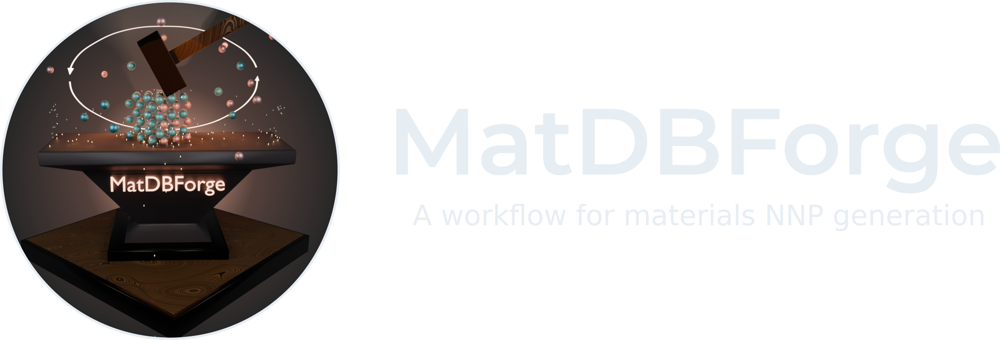

.. MatDBForge documentation master file, created by
   sphinx-quickstart on Tue Oct 15 17:21:48 2024.
   You can adapt this file completely to your liking, but it should at least
   contain the root `toctree` directive.

Intro to MatDBForge
====================

|

MatDBForge is a Python library that aids in the generation of chemical structures databases for training MLIPs (Machine Learning Interatomic Potential) to be used in heterogeneous catalysis. It provides tools to create and manage a database of materials structures for training machine learning models, and allows to interact with workflow tools in order to automate the structure labelling and active learning procedure.

.. toctree::
   :maxdepth: 2
   :caption: Usage

   source/intro.md
   source/install.md
   source/tools.md
   source/input.md
   source/customization.md

.. toctree::
   :maxdepth: 1
   :caption: Examples

   Database Generation <source/results_db_gen.md>

.. toctree::
   :maxdepth: 1
   :caption: Package information

   Package Information <source/modules.rst>
   API and Package Information api/index
