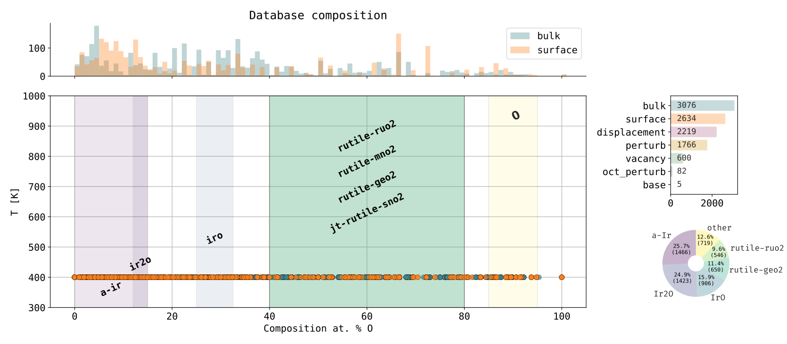
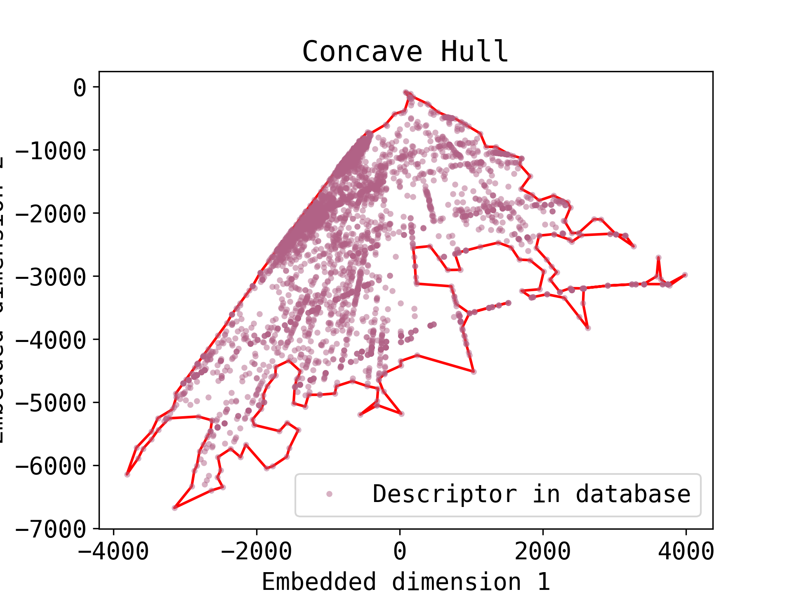

# Database Generation Results

## IrO database

This section shows the generation results for a $\mathrm{IrO}$ database including several rutile phases, templates including $\mathrm{Ir}$, and other metals such as: $\mathrm{RuO_2}$, $\mathrm{SnO_2}$, $\mathrm{GeO_2}$, $\mathrm{TaO_2}$ and $\mathrm{MnO_2}$.

  <picture>
    
  </picture>

An autoencoder can be use to reduce the dimensionality of the descriptors (SOAP in this case) to a 2D representation. The concave hull can be computed in this embedded space to highlight the limits of the database.

  <picture>
    
  </picture>
